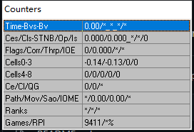

## Counter Template 1
time/estime_bvs-bvdone/bv
ces/cls_stnb/op/is
reff/corr/thrp/ioe
Cells0-3
Cells4-8
ce/cl/qg
path/mov/sao/iome
timerank/bvsrank/rqprank
games/rpi

Cells: 数字计数，需根据个人情况调整公式。取0表示该数字数量达到最小值，取1表示达到最大值，负数表示打破最小值，大于1表示打破最大值。

[_counter_template_1.txt](_counter_template_1.txt)
